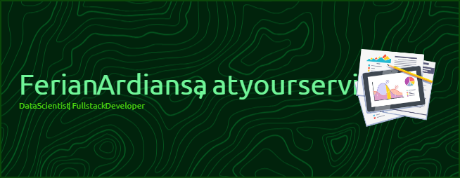

## Halo semuanya, Ferian Ardiansa di sini! 👋

Saya adalah seorang **Pengembang Web Full-stack** yang bersemangat dalam **membangun aplikasi web yang inovatif dan efisien**. Dengan latar belakang dalam [sebutkan area spesifik, misal: pengembangan backend dengan Node.js dan Python, atau frontend dengan React], saya selalu antusias untuk mendalami teknologi baru dan menerapkan solusi kreatif untuk tantangan dunia nyata.

---

### Saat Ini Saya...

- 🔭 **Sedang mengerjakan:** Membangun sebuah aplikasi manajemen proyek berbasis cloud menggunakan **Next.js** dan **Firebase**.
- 🌱 **Sedang belajar:** Mendesain arsitektur **microservices** dengan **Docker** dan **Kubernetes**.
- 👯 **Mencari kolaborasi:** Pada proyek-proyek open-source yang berfokus pada keberlanjutan atau pengembangan alat untuk komunitas developer.
- 🤔 **Mencari bantuan dengan:** Optimasi performa database untuk aplikasi berskala besar.

---

### Mari Terhubung!

- 💬 **Tanyakan saya tentang:** Pengembangan web, React.js, Node.js, Python, atau pengalaman saya di industri teknologi.
- 📫 **Cara menghubungi saya:** ferianardiansa22@email.com atau kunjungi [profil LinkedIn saya](https://www.linkedin.com/in/ferian-ardiansa-junardi-82a8a0269/).
- ⚡ **Fakta menarik:** Saya suka mendaki gunung dan sering mencari inspirasi dari alam bebas.

---

### Bahasa & Alat yang Saya Kuasai

Berikut adalah beberapa teknologi dan alat yang sering saya gunakan dalam pengembangan:

---

### Statistik GitHub Saya

---

### Proyek Pilihan Saya

- **Name Entity Recognition with IndoBERT** -
  Aplikasi Ekstraksi informasi gejala,durasi dan bagian tubuh dari teks konsultasi pasien dengan dokter menggunakan model IndoBERT.
  - [Link ke Repositori Proyek 1](https://github.com/ardiansa22/nama-repo-1)
- **Cerebook** - [Deskripsi singkat proyek ini, misal: Alat CLI untuk mengotomatisasi deployment aplikasi ke server VPS.]
  - [Link ke Repositori Proyek 2](https://github.com/ardiansa22/nama-repo-2)

---

Terima kasih sudah berkunjung! Jangan ragu untuk menjelajahi repositori saya.
